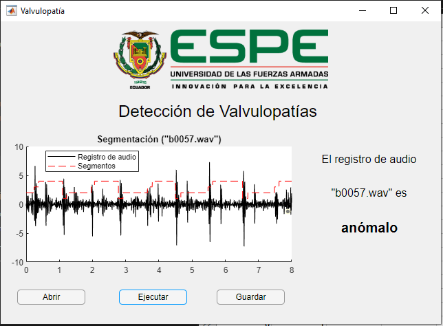

# Valvulopathies-From-ECG
Valvulopathies detection from ECG using 1-D CNN developed in MATLAB (GUI).

Project based from "Ensemble of Feature-based and Deep learning-based Classifiers for Detection of Abnormal Heart Sounds" project by Cristhian Potes et. al.

